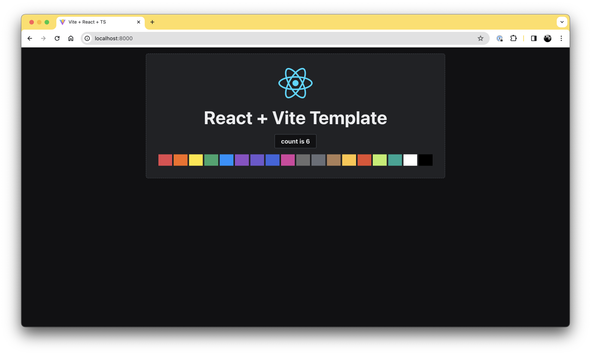

# React / Vite Starter Project



This template provides a minimal setup to get React working in Vite and some ESLint rules.

Includes:

- React / Typescript
- Vite
- CSS Modules
- [clsx](https://github.com/lukeed/clsx)
- [Design Tokens](https://github.com/andreortiz82/ao-design-tokens)
- [Ant Design 5](https://ant.design/components/overview/)
- [AO-UI-Lib](https://github.com/andreortiz82/ao-ui-lib)

## Get Started

```
gh repo clone andreortiz82/react-vite-template
cd react-vite-template/
npm i
npm run dev
```

The project runs on [localhost:3000](http://localhost:3000/)
